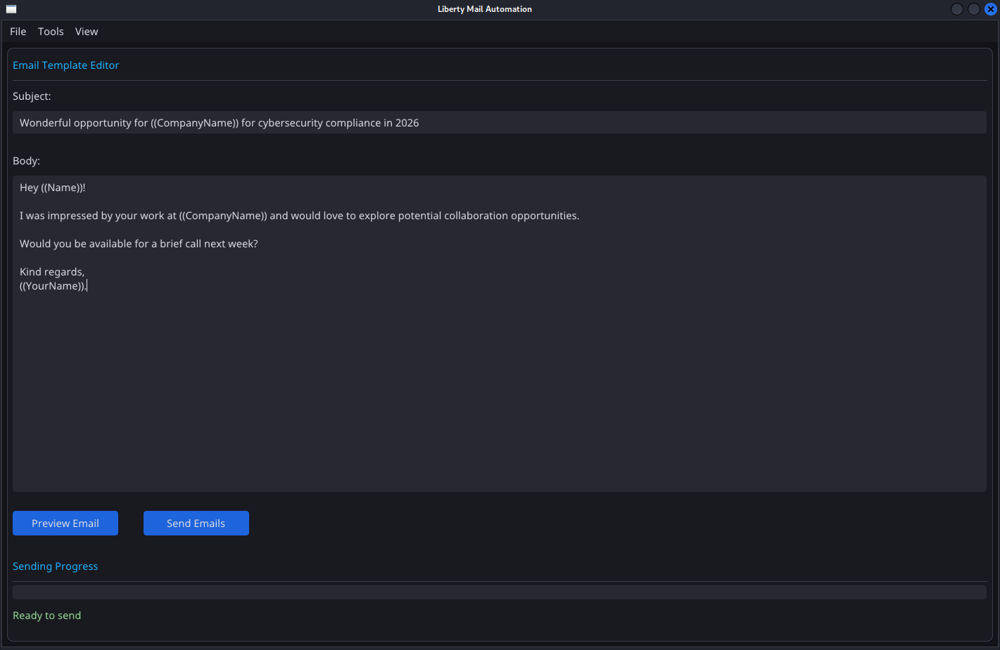
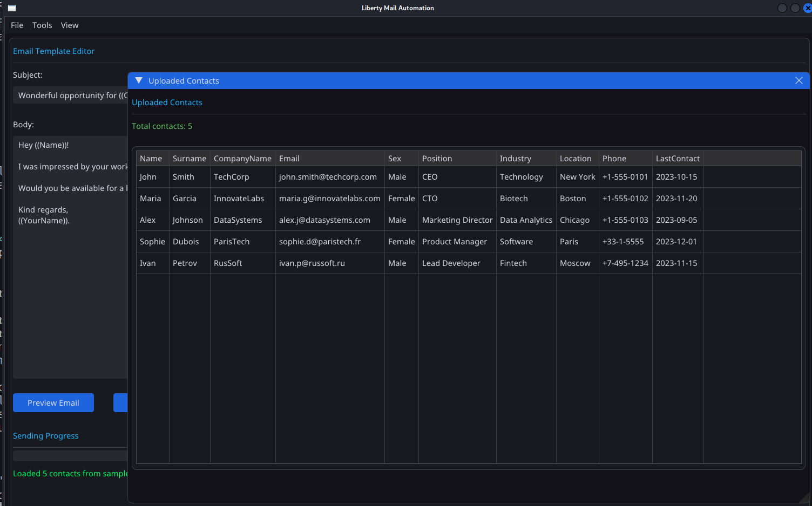
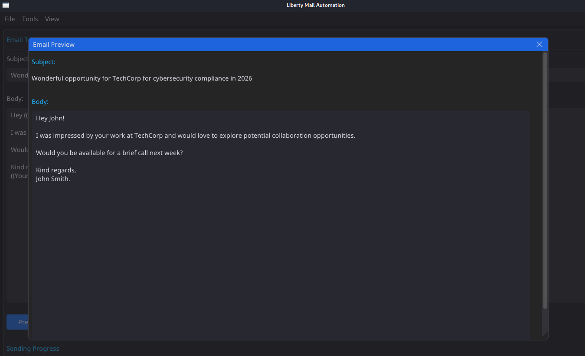
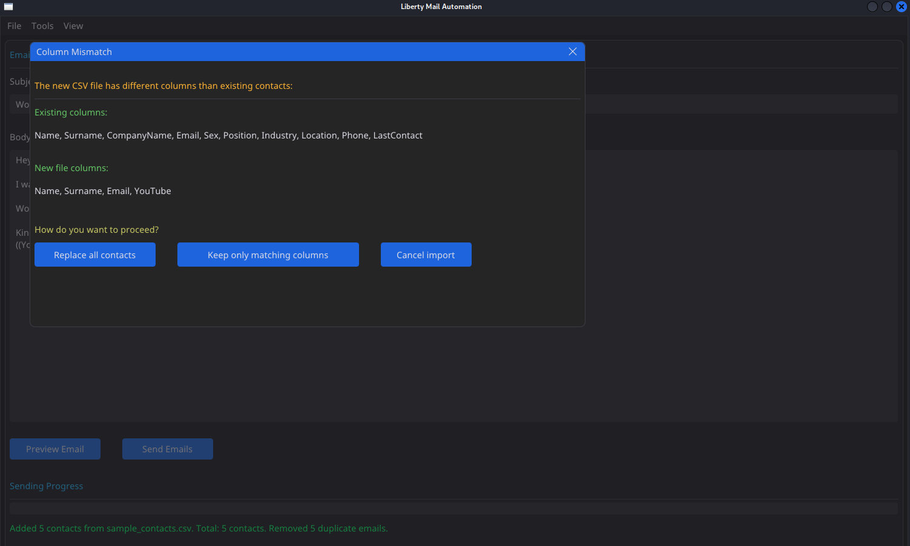
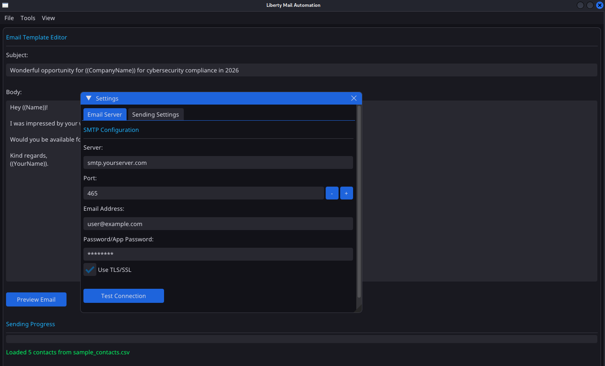
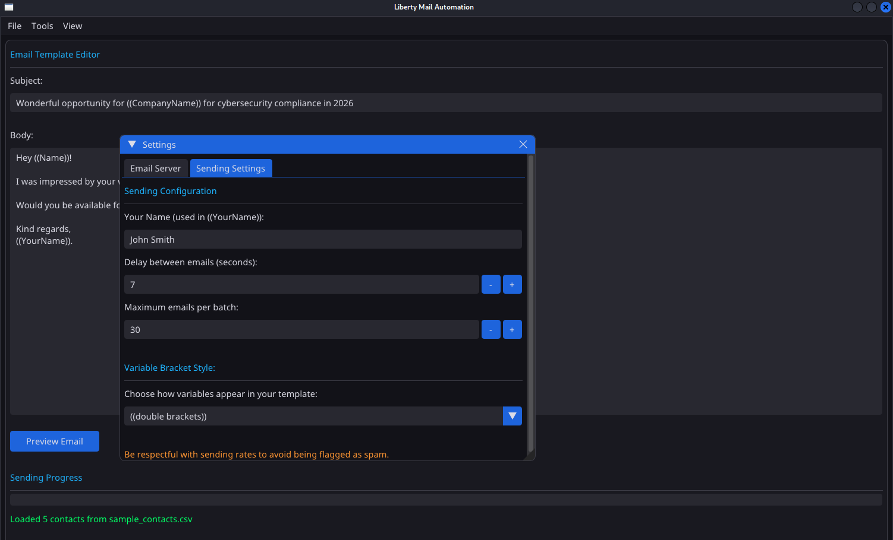

# LibertyMail - minimalist, sleek email client for those who value automation

## From the Founders of Eye of Liberty - https://eyeofliberty.com

Hello everyone! This is a growing, free and open source email client for anyone who wants to easily automate the sending of
emails for marketing, customer retention and anything else you can think of ;)

## How to install

1. Clone the repository from github on any machine that has python 3.
2. pip install dearpygui pandas (or create a virtual environment, and run pip install dearpygui pandas inside of it)
3. python3 main.py - and you're good to go!

## How to use

Below is the home interface of our email client - most of the page is a large input field which allows you to type your main
email to your heart's desire! Most importantly, this field has support for variables that you can use to make each and every one
of your emails perfectly tailored to the people you wish to contact.

  

As you can see in the screenshot above, the text in the double brackets, like ((Name)), ((CompanyName)), ((YourName)) - are the
variables which will be filled in depending on the data that you import.

Currently we support .csv files for the import of contacts, which is the file format most commonly used by lead generation
services and by virtually everyone else in the world of email outreach, supporting both comma and semicolon delimiters. If you
don't have a ready-made file yourself, you can click **Tools -> Generate Sample CSV** which will generate a sample file in the
same directory that you're storing the Liberty Mail app.

Once you're acquired (or generated a sample) CSV file with the contacts you want to email, click **File -> Upload CSV File**, and
select the .csv that you wish to load up. Afterwards, click **View -> Uploaded Contacts** to see the contacts that you have in
system memory right now. 

  

You can click the **Preview Email** button at the bottom of the interface to already preview what
your final email will look like! Afterwards, you can close it and adjust the contents if need be.

  

If you wish to upload a second set of contacts, you can do so, even if it has a slightly different column setup than the previous
file that you've uploaded! For this, I've added **sample.csv** in the same directory as main.py, and you can upload it to have a
look. Both options of replacing all contacts and storing both datasets while keeping matching columns is supported. If you pick
the second option, you'll have an even larger database that contains the contents of two (or more) csv sources that you have
uploaded!

  

But before you start sending the emails, you will have to set up your SMTP settings. Unfortunately, we can't provide this service
for you free of charge, but most hosting providers (regardless of which one you use) should be able to offer an email service as
part of their whole package, and you should be able to find their exact SMTP details on their website. I highly recommend using
Beget, but you can use anything else you'd like.

  

After you set up your server credentials (which are stored locally, you can double check the code if you have any security
concerns) and test your connection to make sure everything works, go ahead and set up your sending settings in the next tab. This
includes both your name you want to sign with (although that's entirely optional), the delay between sending emails in seconds
and the max number of emails per batch. And although ((double brackets)) are used as the default for the email variables, you can
configure any other supported option to be used instead, such as [Square brackets], {Curly brackets}, (((Triple brackets))) and
more.

  

Once you've double-checked that your email template is as you want it to be, click "Send emails" button below the input field and
all of the emails should be sent - enjoy!

## Contributing

We're more than welcome to have people contribute if you have any good ideas on how to improve this - both the existing codebase
and any other cool features you might want to add! Ideally, I'd love keeping liberty-mail a minimalist piece of software, so
don't overcomplicate the interface more than needed, but other than that more than happy to have new features added.

If you have any questions for the lead dev, drop a quick issue on github or email me at eye [at] eyeofliberty.com

## Development TODO - all of them perfect first issues for anyone who wants to contribute!
- In the file explorer, allow selecting the file by double click (could work on some devices right now, but not all)
- Make the UI a bit more responsive
- Make columns disappear if the user wants to
- Allow the user to delete entries by right clicking in the contact view page (currently have to do it manually in the csv file)
